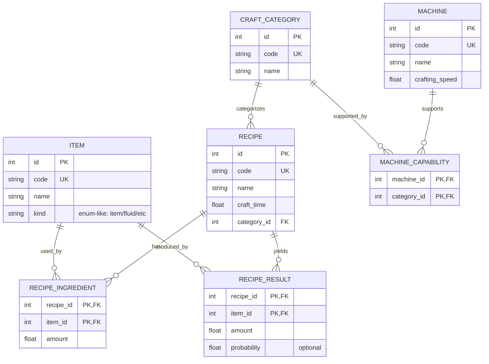

# 游戏数据仓库设计文档：SQLite + SeaORM（只读运行时，迁移/Seed 负责写入）

## 当前仓库职责边界（2026-04 修订）

这一节描述的是当前项目**应当收敛到的边界**，也是后续重构的准绳。

### 总体数据流

应明确区分四层对象，而不是再把它们混在一个 crate 里：

```text
game-data.json
  -> faculator-data::input dto
  -> faculator-data::model / import transform
  -> sqlite
  -> faculator-data::output dto
  -> faculator-core::ddd
  -> app / solver
```

核心原则：

- `game-data.json` 的 schema 不等于领域模型。
- SQLite 表结构也不等于领域模型。
- `faculator-data` 允许同时理解“输入格式”和“数据库结构”。
- `faculator-core` 只表达最终给 `app` / `solver` 使用的领域语义。

### faculator-core

职责：

- 只承载真正的领域模型（DDD）
- 只表达 `app` / `solver` 直接依赖的稳定语义
- 可以定义实体、值对象、聚合、领域服务、领域规则

边界：

- 不负责解析 `game-data.json`
- 不负责适配 SQLite 表结构
- 不为了兼容导出 JSON 而保留 `serde rename`、导出专用字段名、宽表式嵌套结构
- 不承载“百科展示字段”或“导出保真字段”，除非这些字段确实进入领域规则

当前判断：

- 过去 `core` 中的很多 `Item` / `Fluid` / `Recipe` / `Entity` 结构，本质上更像导出 DTO，而不是 DDD
- 因而这些结构应迁移出 `core`，避免继续把 `core` 锁定在 `game-data.json` 的长相上

### faculator-data

职责：

- 承载所有与数据输入、数据入库、数据库读取、组装输出相关的代码
- 作为“导出格式 <-> 数据库模型 <-> 领域模型”之间的桥梁
- 管理 import / normalize / assemble / repository / facade

边界：

- 可以理解 `game-data.json` 的原始 schema
- 可以理解 SQLite / SeaORM 的持久化结构
- 可以包含组装逻辑、逻辑外键、反向引用、嵌套扁平化
- 但不应把数据库内部实现细节直接暴露给 `app` / `solver`

`faculator-data` 内部应明确存在三类类型：

1. `Input DTO`

- 用来解析 `game-data.json`
- 允许高度贴近导出 schema
- 允许保留 `serde rename`、字符串字段、导出嵌套结构
- 它的首要目标是**正确接住输入**

2. `Model`

- 面向数据库建模
- 由 SeaORM entity / ActiveModel / migration schema 共同定义
- 首要目标是**约束、关系、可查询性、可维护性**

3. `Output DTO`

- 从数据库读取 model 后，根据逻辑外键和业务查询需求组装出的读取模型
- 可以是面向某类查询场景的聚合结果
- 首要目标是**把数据库读结果拼成接近领域的结构**

说明：

- `Output DTO` 不是最终 DDD，本质上仍是数据装配层对象
- 但它比数据库 model 更贴近使用场景，因此是进入 `core` 之前最合理的中间层

### faculator-migration

职责：

- 只负责 SQLite schema 演进
- 管理建表、改表、索引、约束、元数据表
- 为数据库构建流程提供可重复执行的 schema 初始化能力

边界：

- 不负责解析 `game-data.json`
- 不负责领域语义
- 不直接承担聚合组装

### faculator-app

职责：

- 最终应用层入口
- 负责把领域对象或稳定读取接口组织成用户可消费的程序行为

边界：

- 不应自己理解导出 JSON
- 不应直接依赖 SeaORM entity
- 应尽量依赖 `faculator-core` 或 `faculator-data` 暴露的稳定门面

### faculator-solver

职责：

- 承载量化、优化、求解逻辑
- 消费领域对象与领域规则

边界：

- 不应直接理解数据库表结构
- 不应直接理解 `game-data.json` 的原始 schema
- 应尽量只依赖 `faculator-core` 的 DDD，或极薄的只读 facade

### faculator-devkit

职责：

- 提供开发辅助工具
- 当前主要是资源/图标提取相关能力

边界：

- 不参与运行时主链路
- 不参与数据库 schema 与导入主流程

## 类型分层规范

这一节是后续设计 `faculator-core` 时必须先满足的规范。

### 1. 判断一个类型是否应该放进 core

如果一个类型满足下面任一特征，它就**大概率不该在 `faculator-core`**：

- 它的字段名、层级、可选性主要是为了匹配 `game-data.json`
- 它的主要工作是“接住输入”而不是“表达领域规则”
- 它依赖大量 `serde rename`、导出专用字符串、导出嵌套对象
- 它是“一个大宽结构”，把多类能力硬摊在一个 struct 上
- 它的字段里大量包含 `group` / `subgroup` / `order` / `hidden` 一类百科展示元数据

### 2. core 中的类型应满足什么特征

一个合格的领域类型，通常更接近下面的样子：

- 以业务语义命名，而不是以导出集合命名
- 面向行为/约束建模，而不是面向 JSON 形状建模
- 一个类型只承载一类稳定语义
- 字段来自领域需要，而不是“导出里正好有”
- 允许一个领域对象由多个数据库表、多个输出 DTO 组合而成

### 3. 当前不应继续放在 core 的对象类型

下列对象，默认先视为 `faculator-data` 层内容，而不是 `core`：

- 直接映射 `game-data.json` 顶层集合的结构
- 为导入而存在的 `Input DTO`
- 为入库而服务的中间转换对象
- 直接暴露数据库列结构的 Model
- 为某一类查询专门拼装的读取 DTO

### 4. core 设计的先后顺序

`faculator-core` 的建设顺序必须固定为：

1. 先定规范
2. 再定对象边界与聚合边界
3. 再定仓储/装配接口
4. 最后才写代码

不能反过来从 `game-data.json` 直接长出一套“看起来像领域对象”的 struct。

## 当前落地建议

建议按下面顺序推进：

1. 在 `faculator-data` 中收容当前贴近导出 schema 的类型

- 命名上明确标出这是 `input dto` 或 `exported dto`
- 它们的首要目标是保真解析，而不是表达领域语义

2. 在 `faculator-data` 中完善导入链路

- `input dto -> normalize / ref resolve -> db model -> insert`
- 让“ref 解析、嵌套拆解、逻辑外键补全”都发生在 `data` 层

3. 在 `faculator-data` 中建立读取装配层

- `model -> query -> output dto`
- 让数据库读取的聚合结果先停在 `output dto`

4. 再设计 `faculator-core`

- 从 `app` / `solver` 的真实使用场景反推领域对象
- 不再从 `game-data.json` 或数据库表结构正推领域对象

5. 最后才决定 `core` 中究竟需要哪些对象

- 例如 `Goods`、`RecipeSpec`、`MachineProfile`、`ModuleSpec`、`EnergyProfile`
- 是否需要 `Entity` 这个名字，也应由领域语义决定，而不是由导出集合名决定

## 执行摘要

本项目定位为“游戏数据仓库”（Game Data Warehouse）：将复杂、紧密耦合的游戏配置数据（类似 entity["video_game","Factorio","automation game 2016"] 的 machine–recipe–item 关系模型）落在 SQLite 中，以获得关系型建模的“引用/约束/关联查询”能力，并把 SQLite 数据库文件作为可分发的数据产物（single-file、跨平台、可作为应用文件格式）。citeturn4view1turn17view1turn17view2
运行时以“只读查询”为主：应用启动/运行期间几乎不做动态增删改写；所有写入（建表、加索引、导入初始数据、质量校验、统计优化）在构建阶段或迁移/seed 阶段完成。citeturn4view6turn4view2turn17view0turn23view1
在数据库访问层面，SeaORM 被当作“类型化读取 + 关系装载器”，而不是传统 CRUD 业务系统里的“全自动持久化上下文”。关键能力点是：统一实体映射、关系建模、避免 N+1 的 Entity Loader（join/data-loader 策略）、以及可选的流式读取/部分列读取用于性能与内存控制。citeturn4view3turn12view0turn14view0
数据一致性策略上，优先采用“物理外键 + 唯一约束 + CHECK 约束 + 必要索引”的组合；同时明确 SQLite 外键需要显式开启、且设置存在连接/事务边界要求，因此将外键开关在连接创建阶段（sqlx/SeaORM connect options）固化，避免运行时/迁移中途切换带来的不确定性。citeturn11view0turn16view2turn21view0turn4view7

## 项目定位与使用场景

**核心诉求**是：用关系模型表达“引用”与“关系约束”，解决 JSON/YAML/TOML/CSV 等序列化格式在多表引用、反向索引、唯一性与一致性校验方面的天然短板（这些格式往往只能靠人为约定与自写校验器补齐）。

**SQLite 作为可分发数据产物**具备几个与“游戏数据包”高度契合的特征：
第一，SQLite 数据库通常是单文件，可直接复制分发，并且文件格式跨平台（32/64 位、大端/小端）且承诺长期兼容；适合作为“应用文件格式”（application file format）。citeturn4view1turn17view1
第二，SQLite 的“数据库完整状态通常在一个主数据库文件中”，但需要理解：事务过程中可能出现 rollback journal 或 WAL 文件；若你把 DB 当作分发资产，需要在构建阶段选择/收敛合适的 journal 模式与产物形态，避免额外文件对打包与部署造成干扰。citeturn17view0turn4view8

**写入发生在构建期/迁移期**是本项目的关键工程约束：
SeaORM 的迁移系统支持在 `up/down` 中执行 DDL，并允许用 SeaQuery DSL 或原生 SQL 编写；同时也支持在迁移中拿到连接执行 seed（可用 SeaORM API 或直接执行 SeaQuery/SQL）。citeturn4view6turn4view2
迁移执行方式既可以通过 CLI（例如 `up/down/fresh/refresh/status`），也可以在工具程序/构建脚本中以 `MigratorTrait::up/down` 编程方式调用；这使得“构建数据库产物”可以成为一条可自动化的流水线，而不必依赖人工操作。citeturn14view1turn15view0

image_group{"layout":"carousel","aspect_ratio":"16:9","query":["Factorio assembling machine recipe UI","Factorio crafting recipes items machines","SQLite database file cross platform illustration"],"num_per_query":1}

## 数据模型与约束设计

本节给出“machine–recipe–item”最小可用模型（MVP），并同时预留扩展点（科技树、配方解锁、物品标签、流体、模块、配方变体等）。重点不在字段是否“像某款游戏”，而在：**可维护的主键策略、外键/约束/索引的工程化落地**。

### 表设计总体原则

**主键策略（推荐：数值 surrogate key + 稳定业务 key）**
建议每个核心实体表同时具备：

- `id INTEGER PRIMARY KEY`：内部连接/索引友好（在 SQLite 普通表中，`INTEGER PRIMARY KEY` 可作为 rowid 别名，通常对存储与查找最有利）。citeturn23view3turn16view2
- `code TEXT NOT NULL UNIQUE`：对外稳定标识（用于从 CSV/YAML/设计表导入、调试、版本 diff、以及跨版本引用稳定性）。SQLite 外键父键列若不是主键，则必须有 UNIQUE 约束/唯一索引才能被可靠引用；因此 `code UNIQUE` 也利于某些“自然键引用”的场景。citeturn16view2

**关系表（junction table）一律显式建模**
多对多关系（如“机器支持哪些配方类别”、“配方有哪些输入输出”、“配方属于哪些标签”）使用 junction table，并优先采用**复合主键**（`PRIMARY KEY(a_id, b_id)`）防重复。SeaQuery/SeaORM 对复合主键是常规路径，SeaORM 的 `find_by_id` 也明确支持复合主键。citeturn12view0turn5view0

**外键 + 索引配套**
SQLite 官方文档强调：外键本质上会触发对子表引用的查询检查；若子键没有索引，可能导致全表扫描，成本在复杂数据集中不可接受。因此建议：

- 每条外键关系，至少在**子表外键列**上建普通索引（不要求唯一）。citeturn16view2
- 父表被引用的列必须是主键或唯一键（如上面的 `id` 或 `code`）。citeturn16view2

**CHECK 约束用于“配方数量、耗时等数值”**
例如 `amount > 0`、`craft_time > 0` 这类规则，用 CHECK 约束能把“数据质量问题”前移到构建阶段暴露（而不是让运行时逻辑背锅）。SQLite 能在 ALTER TABLE ADD COLUMN 时对新增 CHECK/NOT NULL 等约束做校验；但更推荐在初始建表阶段一次性定义清楚。citeturn24view0

**是否使用 WITHOUT ROWID（高级优化，按需）**
SQLite 支持 `WITHOUT ROWID` 表：去除 rowid，并以主键作为聚簇索引，有时有空间与性能优势；但它是 SQLite 特有语法，跨数据库不可移植。对本项目而言，它更适合用于：**复合主键的 junction table**（例如 `recipe_ingredient(recipe_id,item_id)`），因为此类表天然以复合主键唯一标识一行。citeturn23view3turn23view3
建议做法是：先不用，等数据量/查询模式稳定后，用 `EXPLAIN QUERY PLAN` 与基准测试验证是否值得引入（见后文“性能与缓存策略”）。citeturn23view0

### 示例 ER 图（MVP）

下面是建议的最小模型：物品（Item）、配方（Recipe）、机器（Machine）、制作类别（CraftCategory）及其映射。此图强调关系结构与约束点（主键/外键/唯一性），字段细节可在 schema 细化阶段扩展。



### 约束与索引清单（建议落地）

面向工程落地，建议把“表级约束/索引”写成一份可执行清单（随后直接映射到 migration）：

- `ITEM(code)` UNIQUE；`ITEM(kind)` 可加 CHECK（限定枚举值）。
- `RECIPE(code)` UNIQUE；`RECIPE(craft_time > 0)` CHECK；`RECIPE(category_id)` FK -> `CRAFT_CATEGORY(id)`。
- `RECIPE_INGREDIENT`：`PRIMARY KEY(recipe_id, item_id)`；`amount > 0` CHECK；`INDEX(item_id)` 用于反向查询“某物品被哪些配方消耗”。citeturn16view2
- `RECIPE_RESULT`：同上；可加 `probability BETWEEN 0 AND 1` CHECK。
- `MACHINE_CAPABILITY`：`PRIMARY KEY(machine_id, category_id)` + `INDEX(category_id)` 用于查询“某类别有哪些机器”。

这样建模的直接收益是：引用一致性由数据库兜底（外键），重复数据由主键/唯一约束杜绝（UK/PK），而常用反向查询靠索引保证性能路径。citeturn16view2turn23view0

## 构建流水线：迁移、Seed 与版本管理

本项目的“数据库写入”应当被视为**构建流水线**的一部分，而不是运行时逻辑。这一节给出可执行的迁移/seed 组织方式、什么时候用 SeaQuery DSL vs Raw SQL、以及版本和幂等性策略。

### 迁移与 Seed 的职责划分

**迁移（schema migrations）**
每个迁移包含 `up/down`，用于建表、加列、建索引等 Schema 演进；SeaORM 官方明确迁移由 `up/down` 构成，并支持用 SeaQuery 或 SQL 来写 DDL。citeturn4view6turn4view6

**Seed（data seeding）**
Seed 负责“把设计数据导入数据库”。SeaORM 文档给出：在迁移中可从 `SchemaManager` 获取连接，直接用 SeaORM API 插入数据；也可以直接执行 SeaQuery 语句。citeturn4view2turn4view2

工程建议：把“schema migration”与“seed migration”拆成两类迁移文件（同一个 migrator 顺序执行即可），原因是：

- schema 变化需要可回滚（down），seed 往往只需要“重建时可重跑”。
- seed 可能体量很大，把海量数据写进 Rust 源码迁移文件会降低可维护性；更好的方式是迁移里触发“导入器工具”（见后文工具链）。这属于工程实践建议，SeaORM 文档并不强制。citeturn4view2turn14view1

### 迁移执行与版本表

SeaORM 的迁移执行可以通过 CLI 或编程调用；迁移框架默认使用 `seaql_migrations` 作为迁移记录表名（可覆盖，但建议默认）。citeturn14view1turn15view0
对于“数据库产物构建”，推荐将 migrator 以编程方式集成到 `tools/build_db` 二进制中（或构建脚本），实现“一键生成游戏数据 DB”。

### Mermaid 流程图：构建 DB 产物

```mermaid
flowchart TD
  A[源数据<br/>CSV/YAML/表格/自定义DSL] --> B[导入器/校验器<br/>tools/import]
  B -->|生成插入批次或SQL文件| C[创建空SQLite<br/>build/db/game_data.sqlite]
  C --> D[运行Schema Migrations<br/>Migrator::up]
  D --> E[运行Seed步骤<br/>SeaORM插入/SQL批量导入]
  E --> F[一致性校验<br/>外键检查/唯一性/自定义规则]
  F --> G[性能收敛<br/>CREATE INDEX + PRAGMA optimize/ANALYZE]
  G --> H[产物封存<br/>VACUUM(可选)+拷贝到assets]
  H --> I[运行时只读打开<br/>mode=ro(+immutable可选)]
```

其中“PRAGMA optimize/ANALYZE”是 SQLite 官方推荐的优化路径之一：ANALYZE 会收集统计信息帮助查询优化器选择更好计划；官方也建议在 schema 变更、尤其是 CREATE INDEX 后运行 optimize。citeturn23view1turn23view1

### SeaQuery DSL vs Raw SQL：迁移场景对比表

| 维度           | SeaQuery DSL（SeaORM Migration / SeaQuery Schema AST）                                                                          | Raw SQL（字符串/SQL 文件）                                                                                                        |
| -------------- | ------------------------------------------------------------------------------------------------------------------------------- | --------------------------------------------------------------------------------------------------------------------------------- |
| 可移植性       | 面向 MySQL/Postgres/SQLite 的统一抽象，尽量对齐各方行为（适合保留后路或未来换库）citeturn22view0turn4view6                  | 强依赖 SQLite 语法；若保留 SQLite 特性（如 `WITHOUT ROWID`）则几乎不可移植citeturn23view3turn10view0                          |
| 类型/结构安全  | 用 AST 构造 schema/查询，减少拼接错误与注入风险；适合“机械型 DDL”citeturn22view0turn4view6                                  | 表达力最直接，复杂 DDL（触发器、复杂 CHECK、临时表重建流程）更容易写清楚；但需要自行保证正确性citeturn13view0turn23view2      |
| 复杂语法可读性 | 对复杂约束/大表/大量字段时可能冗长；但适合标准化模板                                                                            | 人类可读性强，尤其是批量 INSERT、复杂迁移脚本（重建表）                                                                           |
| 生态工具支持   | 更便于复用 Entity 定义生成建表/索引（Schema::create_table_from_entity / create_index_from_entity）citeturn5view0turn13view2 | 更便于与 sqlite3 CLI、外部 SQL 文件、审计/评审流程结合                                                                            |
| 推荐使用点     | schema 的“核心骨架”：建表、主键、外键、常规索引、可复用模板                                                                     | seed 批量导入、SQLite 特有 pragma/优化、复杂重建表迁移（见下文风险与 ALTER TABLE 限制）citeturn24view0turn11view0turn13view0 |

补充：SeaORM 官方迁移文档明确支持“用 SeaQuery 或 SQL 写 DDL”。citeturn4view6turn3search5

### 外键开关与事务边界：必须纳入迁移设计

SQLite 外键约束默认不一定开启；官方指出外键通常需要应用在运行时启用，且设置与连接有关。citeturn4view0turn11view0
更关键的是：`PRAGMA foreign_keys` **在事务内是 no-op**（SQLite pragma 文档明确写出：只有在没有 pending BEGIN/SAVEPOINT 时才能启用或禁用）。因此，不要在“迁移事务中途”试图切换外键开关来“临时跳过约束”。citeturn11view0turn16view2

工程落地建议：在连接创建阶段（sqlx connect options）显式设置 foreign_keys 开启（见后文 SeaORM 集成），保证迁移、seed、运行时一致。citeturn21view0turn4view7

## SeaORM 集成与只读访问层

这一节的目标是：把 SeaORM 用成“高质量只读访问层”，而不是传统 CRUD 业务框架。

### Entity/Model/关系定义的落点

SeaORM 的 Select 文档给出基本心智：定义 entity 后，每一行数据对应一个 `Model`；默认会选取 Column enum 中所有列，也可用 partial model 只取子集。citeturn12view0turn12view0
对于游戏数据仓库，建议按以下原则组织 entity：

- **Entity（表）只表达持久化结构**：字段、类型、约束（unique/indexed）、关系（has_many/belongs_to 等）。
- **领域读模型（domain read model）**独立于 entity：例如 `RecipeGraph`、`MachineProfile` 这种运行时需要的聚合结构，不要强行塞进 Model。SeaORM 本身也支持通过自定义 struct（FromQueryResult）承接复杂查询/嵌套结果。citeturn13view0turn12view0

### 建表/建索引：利用 Schema 从 Entity 派生（可选）

如果你希望减少“schema 与 entity 漂移”，可以用 `Schema::create_table_from_entity` 从 Entity 派生建表语句，它会把 Entity 定义的列与外键带出来；但注意：官方文档指出该方法不会创建索引（需要额外建索引）。citeturn5view0turn13view2
这对你这种“数据仓库式 schema”特别好用，因为：你可以把“结构定义”尽量集中在 entity，再在 migration 中统一生成 DDL；索引则由 `Schema::create_index_from_entity` 或显式 `CREATE INDEX` 补齐。citeturn13view2turn5view0

### 关系装载与 N+1：优先使用 Entity Loader

SeaORM 2.0 的 Entity Loader 明确目标就是消除嵌套查询中的 N+1：

- 1-1 用 join（最多三张表一条查询）；
- 1-N、M-N 用 data loader（含 junction table 的 M-N 也能单次查询）；
- 多层 nested 会合并 ID，减少查询次数。citeturn4view3turn4view3

在游戏数据常见的读取场景中（例如“给我某配方的输入/输出/类别/可生产机器列表”），Entity Loader 基本就是默认工具；它比“先查配方、再 find_related 逐个查子项”的 lazy loading 方式更稳定。SeaORM 文档也强调：lazy loading 会增加 round trips，eager loading/loader 在批量场景更合适。citeturn12view0turn4view3

### 只读 Repository / Facade 的封装方式

建议把 SeaORM 访问封装成一个“只读门面”（facade），而不是每张表一个 CRUD service。原因是：你的运行时几乎无写入，真正重要的是**领域查询接口**而不是通用 CRUD。

推荐形态（伪接口）：

- `GameData`（facade）：持有 `DatabaseConnection`，对上提供只读 API；内部用 entity loader/自定义查询组合来做聚合读取。
- `ItemRepo/RecipeRepo/MachineRepo`：可选的内部分仓，但仍以“查询组合”为主，而非 CRUD。

SeaORM 的连接实现基于 sqlx pool：每次调用 `execute/query_one/all` 都会从连接池获取/释放连接，并且多个查询可并行 await。这个事实会影响“每连接 PRAGMA”的设置策略（见下一小节）。citeturn4view7turn7search5

### 物理外键与 cascade 策略

**结论：建议写物理外键，但谨慎依赖 ON DELETE CASCADE 作为业务机制。**

理由一：你把 SQLite 当作“关系型数据表达格式”，外键约束正是它的强项；外键能把“引用存在性”从代码层移到数据层，避免孤儿数据。citeturn4view0turn16view1
理由二：SQLite 外键对性能的关键在索引配套，配齐子键索引即可。citeturn16view2
由于你运行时基本不删改，cascade delete 的需求很弱；建议默认使用 `RESTRICT/NO ACTION`（防误删），在构建/工具链需要批量清理时再由工具显式执行删除顺序或“重建数据库”。SQLite 的语法支持 ON DELETE/ON UPDATE 动作，但是否启用应以工程风险最小化为原则。citeturn4view0turn24view0

### SQLite 打开方式：运行时只读与 immutable（可选）

SeaORM 的连接文档示例中明确给出 SQLite 连接字符串支持 `mode=ro`（只读）。citeturn7search5
如果你把 DB 当作只读资产并且确保文件不会被其他进程改写，可考虑 SQLite URI 的 `immutable=1`：官方说明 immutable 会让 SQLite 以只读方式打开，并跳过锁与变更检测；但若文件实际发生变化，可能导致错误结果或 SQLITE_CORRUPT。citeturn9view0
这在“游戏打包资产 + 运行时只读”场景里可能有价值（减少锁争用/避免生成附加文件），但要把“文件不可变”作为明确前置条件写进工程约束。

## 运行时查询 API、性能与缓存

这一节给出一套可直接落地的“查询 API 目录”，并说明如何用 SeaORM/SQLite 工具避免性能陷阱。

### 典型查询接口列表（建议从这些开始）

建议以“游戏运行时真正需要的形状”定义 API，而不是暴露表级查询。示例（命名仅示意）：

- `get_item_by_code(code) -> Item`（常用：内存索引可直接加速）
- `get_recipe_by_code(code) -> RecipeCore`
- `get_recipe_detail(recipe_id) -> {recipe, ingredients[], results[], category, machines[]}`（聚合读取）
- `list_recipes_using_item(item_id) -> Vec<RecipeRef>`（反向查询，依赖 `recipe_ingredient(item_id)` 索引）citeturn16view2
- `list_machines_for_category(category_id)`
- `search_items_by_name_prefix(prefix)`（如需要，可以建 `name` 的索引或 FTS；FTS 属扩展议题，此处不展开）

这类接口的共同点是：以**域概念**为中心，天然适合把 loader 与缓存策略内聚在 facade 内部，让调用方不必知道“到底 join 了几次”。

### 聚合读取示例：使用 Entity Loader 构建“配方详情”

对于 `Recipe -> Ingredients/Results -> Item` 这种多跳关系，Entity Loader 能用 join + data loader 组合减少 N+1；官方明确其策略与“ID 合并”行为。citeturn4view3turn4view3
在你的数据仓库里，推荐把“聚合读取”做成**一次 facade 调用**，内部再根据热路径决定：

- 直接用 loader 拉出嵌套结构；或
- 分两步：先批量查 recipe 列表，再用 load_many 批量把 ingredients/results 补齐（适合列表页场景，减少行重复与带宽）。SeaORM 文档对 eager loading 与 loader 的权衡有明确说明。citeturn12view0turn4view3

### 避免 N+1 的具体规则

工程上可以把规则写成 code review checklist：

- 任何“for 循环里 find_related/one/all”的写法，默认视为潜在 N+1；优先改成 Entity Loader 或批量 loader。citeturn12view0turn4view3
- 对列表页/批量加载，优先用“批量加载 + 分组”的方式避免 join 导致父表行重复；SeaORM 文档指出 model loader 是以多一次查询换带宽/重复行。citeturn12view0

### 性能与缓存策略

**构建期优化：索引 + optimize/ANALYZE**
SQLite 官方文档说明：ANALYZE 会收集表/索引统计供优化器选择更佳计划；在 schema 变化、尤其 CREATE INDEX 后建议运行 optimize/ANALYZE。citeturn23view1
因此建议把 `PRAGMA optimize;`（或必要时 ANALYZE）作为 DB 产物构建流水线的固定步骤之一（见前文流程图）。citeturn23view1

**调试期可观测性：EXPLAIN QUERY PLAN**
SQLite 文档指出 EXPLAIN QUERY PLAN 用于获取查询执行策略的高层描述，并“最重要地报告查询如何使用索引”。建议把它纳入性能排查常规手段：对热查询，先看是否走索引、是否出现临时排序 B-Tree、是否意外全表扫描。citeturn23view0turn16view2

**运行期缓存：按访问模式选型**
在“只读数据仓库”里，缓存往往比传统业务库更有效：

- 对高频点查（`get_item_by_code`、`get_recipe_by_code`）：启动时全量加载并构建 `HashMap<code, id>` 或 `HashMap<code, Model>`，几乎可以把 DB 访问降到最低。
- 对中频聚合查（配方详情、机器能力）：可做 LRU（按 recipe_id 缓存聚合结果），或做“预计算表/物化视图表”（SQLite 没有真正物化视图概念，但你可以落地成普通表并在构建期填充）。
- 对数据量较大但顺序遍历场景：用 SeaORM streaming 以异步流方式减少一次性内存分配。citeturn14view0turn14view0

缓存是工程策略范畴，SQLite/SeaORM 并不替你决定；但上述三类路径能覆盖绝大多数游戏数据访问模式。

## 工程结构、示例代码与风险清单

本节给出目录结构建议、迁移/seed 代码片段（DSL 与 raw SQL 各一段），并集中列出必须提前规避的风险点，以及后续讨论议题清单。

### 工程目录与工具链建议

推荐采用 workspace 分 crate（或至少模块分层），使“运行时只读查询”与“构建期写入/导入”解耦：

- `crates/game_data`：对外暴露 `GameData` facade、只读 API、缓存与聚合模型。
- `crates/entity`：SeaORM entities，仅表达 schema 与 relation。
- `crates/migration`：SeaORM migration crate（schema + seed 迁移）。citeturn4view6turn14view1
- `crates/tools`：一组二进制工具：
  - `build_db`：生成最终 `game_data.sqlite` 产物（运行 migrator、导入 seed、校验、optimize/analyze、封存）。citeturn15view0turn23view1
  - `validate_db`：做一致性检查（外键检查、业务规则检查）。SQLite 提供 `PRAGMA foreign_key_check` 用于检测外键违规；pragma 文档对其行为有描述。citeturn11view0
  - `export_db`：导出为 JSON/CSV（用于调试、diff、mod 支持）

**把 SQLite 当作编译产物**的落地方式：

- 构建时在 `target/` 或 `build/` 目录生成 DB，然后复制到 `assets/`（或打包目录）。SQLite 作为应用文件格式的官方论证强调其单文件、跨平台、事务与可扩展性等特征，非常符合这种“产物化”工作流。citeturn17view1turn4view1
- 在 DB header 中写入 `PRAGMA application_id` 与 `PRAGMA user_version` 作为“格式签名与版本号”。SQLite pragma 文档说明 application_id 适用于把 SQLite 作为应用文件格式时标识具体文件类型；user_version 则是应用自定义版本字段。citeturn10view0turn11view0

### 迁移/Seed 示例代码片段

#### 示例一：SeaQuery DSL 写 schema migration（建表 + 外键 + 索引）

> 适用场景：表结构相对标准、你想保留跨数据库可移植性、并希望通过 AST 降低拼写错误。SeaORM 迁移框架明确支持以 SeaQuery 写 DDL。citeturn4view6turn22view0

```rust
use sea_orm_migration::prelude::*;

#[derive(DeriveMigrationName)]
pub struct Migration;

#[async_trait::async_trait]
impl MigrationTrait for Migration {
    async fn up(&self, manager: &SchemaManager) -> Result<(), DbErr> {
        // 1) item
        manager
            .create_table(
                Table::create()
                    .table(Item::Table)
                    .if_not_exists()
                    .col(
                        ColumnDef::new(Item::Id)
                            .integer()
                            .not_null()
                            .primary_key(), // SQLite: INTEGER PRIMARY KEY ~ rowid alias
                    )
                    .col(ColumnDef::new(Item::Code).string().not_null().unique_key())
                    .col(ColumnDef::new(Item::Name).string().not_null())
                    .col(ColumnDef::new(Item::Kind).string().not_null())
                    .to_owned(),
            )
            .await?;

        // 2) craft_category
        manager
            .create_table(
                Table::create()
                    .table(CraftCategory::Table)
                    .if_not_exists()
                    .col(ColumnDef::new(CraftCategory::Id).integer().not_null().primary_key())
                    .col(ColumnDef::new(CraftCategory::Code).string().not_null().unique_key())
                    .col(ColumnDef::new(CraftCategory::Name).string().not_null())
                    .to_owned(),
            )
            .await?;

        // 3) recipe
        manager
            .create_table(
                Table::create()
                    .table(Recipe::Table)
                    .if_not_exists()
                    .col(ColumnDef::new(Recipe::Id).integer().not_null().primary_key())
                    .col(ColumnDef::new(Recipe::Code).string().not_null().unique_key())
                    .col(ColumnDef::new(Recipe::Name).string().not_null())
                    .col(ColumnDef::new(Recipe::CraftTime).double().not_null())
                    .col(ColumnDef::new(Recipe::CategoryId).integer().not_null())
                    .foreign_key(
                        ForeignKey::create()
                            .from(Recipe::Table, Recipe::CategoryId)
                            .to(CraftCategory::Table, CraftCategory::Id)
                            .on_delete(ForeignKeyAction::Restrict)
                            .on_update(ForeignKeyAction::Cascade),
                    )
                    .to_owned(),
            )
            .await?;

        // 4) recipe_ingredient (junction)
        manager
            .create_table(
                Table::create()
                    .table(RecipeIngredient::Table)
                    .if_not_exists()
                    .col(ColumnDef::new(RecipeIngredient::RecipeId).integer().not_null())
                    .col(ColumnDef::new(RecipeIngredient::ItemId).integer().not_null())
                    .col(ColumnDef::new(RecipeIngredient::Amount).double().not_null())
                    .primary_key(
                        Index::create()
                            .name("pk_recipe_ingredient")
                            .col(RecipeIngredient::RecipeId)
                            .col(RecipeIngredient::ItemId),
                    )
                    .foreign_key(
                        ForeignKey::create()
                            .from(RecipeIngredient::Table, RecipeIngredient::RecipeId)
                            .to(Recipe::Table, Recipe::Id)
                            .on_delete(ForeignKeyAction::Restrict),
                    )
                    .foreign_key(
                        ForeignKey::create()
                            .from(RecipeIngredient::Table, RecipeIngredient::ItemId)
                            .to(Item::Table, Item::Id)
                            .on_delete(ForeignKeyAction::Restrict),
                    )
                    .to_owned(),
            )
            .await?;

        // 索引：ingredient.item_id 用于反向查询（SQLite 官方推荐：子键索引几乎总是有益）
        manager
            .create_index(
                Index::create()
                    .name("idx_recipe_ingredient_item_id")
                    .table(RecipeIngredient::Table)
                    .col(RecipeIngredient::ItemId)
                    .to_owned(),
            )
            .await?;

        Ok(())
    }

    async fn down(&self, manager: &SchemaManager) -> Result<(), DbErr> {
        // 回滚顺序：先 drop junction，再 drop 主表
        manager.drop_table(Table::drop().table(RecipeIngredient::Table).to_owned()).await?;
        manager.drop_table(Table::drop().table(Recipe::Table).to_owned()).await?;
        manager.drop_table(Table::drop().table(CraftCategory::Table).to_owned()).await?;
        manager.drop_table(Table::drop().table(Item::Table).to_owned()).await?;
        Ok(())
    }
}

#[derive(DeriveIden)]
enum Item { Table, Id, Code, Name, Kind }
#[derive(DeriveIden)]
enum CraftCategory { Table, Id, Code, Name }
#[derive(DeriveIden)]
enum Recipe { Table, Id, Code, Name, CraftTime, CategoryId }
#[derive(DeriveIden)]
enum RecipeIngredient { Table, RecipeId, ItemId, Amount }
```

这段示例背后的关键点：

- SeaORM 迁移框架的 DDL 写法（SeaQuery 或 SQL）是官方支持路径；up/down 明确分离。citeturn4view6
- SQLite 外键性能强依赖子键索引，`recipe_ingredient(item_id)` 索引是典型必需项。citeturn16view2

#### 示例二：Raw SQL 写 seed（批量插入 + 构建期优化）

> 适用场景：seed 数据量大、你更想用 `.sql` 文件或更直观的 INSERT；或者你需要 SQLite 特定语法/pragma/优化步骤。SeaORM 2.0 提供 raw SQL 能力（含 raw_sql 宏等），也可直接执行 Statement。citeturn13view0turn4view2

```rust
use sea_orm::{DatabaseConnection, DbBackend, Statement, ConnectionTrait};

pub async fn seed_items(db: &DatabaseConnection) -> Result<(), sea_orm::DbErr> {
    // 示例：把少量种子写在 SQL 里（大量数据建议从文件读入并分批）
    let sql = r#"
    INSERT INTO item(code, name, kind) VALUES
      ('iron-ore', 'Iron Ore', 'item'),
      ('iron-plate', 'Iron Plate', 'item'),
      ('assembler-1', 'Assembling Machine 1', 'item');
    "#;

    db.execute(Statement::from_string(DbBackend::Sqlite, sql.to_owned()))
        .await?;

    // 构建期优化：在 schema/index 变更后运行 optimize（SQLite 推荐）
    db.execute(Statement::from_string(DbBackend::Sqlite, "PRAGMA optimize;".to_owned()))
        .await?;

    Ok(())
}
```

注意事项：

- Raw SQL 更直接，但要把“正确性与安全性”作为责任边界写清楚。SeaORM Cookbook 对“unprepared SQL”提示过注入风险；在迁移/seed 这种“内置静态 SQL”场景风险可控，但仍建议避免拼接外部输入。citeturn6search19turn13view0
- 如果 seed 规模很大，建议把源数据放在外部文件（CSV/自定义格式），工具层做批量插入；迁移只负责 schema 与少量必要内置数据。SeaORM 文档允许在 migration 里拿到连接直接做数据操作。citeturn4view2turn14view1

### 风险与注意事项

**外键启用与连接池带来的“每连接设置”问题**
SQLite 明确：外键 enforcement 需要通过 PRAGMA 设置，且 pragma 文档强调 `PRAGMA foreign_keys` 在事务内无效；此外，外键默认可能为 OFF，应用不应依赖默认值。citeturn11view0turn4view0
SeaORM 的 `DatabaseConnection` 底层是 sqlx pool，每次查询会 acquire/release 连接；若你通过“执行一次 PRAGMA”来启用外键，可能只影响某一条连接而非整个池。citeturn4view7
工程建议：用 `ConnectOptions::map_sqlx_sqlite_opts` 显式设置 `foreign_keys(true)`（并按需设置 `read_only(true)`、`immutable(true)`、journal_mode 等），从连接创建时固化。citeturn20view0turn21view0turn9view0

**SQLite ALTER TABLE 能力有限，复杂 schema 演进可能需要“重建表”流程**
官方 ALTER TABLE 文档明确：SQLite 只支持有限子集（rename table/rename column/add column/drop column 等）；更复杂的结构变更需要走“建 new_X -> 拷贝数据 -> drop old -> rename -> 重建索引/触发器/视图”的流程，并且在外键启用场景要严格按步骤操作。citeturn24view0turn24view0
这意味着：当你未来 schema 演进到“改约束、改主键、拆表/合表”时，迁移脚本复杂度会显著上升；此时 raw SQL 往往比 DSL 更容易表达完整步骤（但也更需要严格 review）。citeturn24view0turn4view6

**WAL 模式与“只读分发资产”之间的摩擦**
SQLite WAL 文档指出：WAL 会伴随 `-wal`/`-shm` 文件，并可能降低作为 application file-format 的吸引力；同时对“只读打开 WAL 数据库”存在条件限制（需要文件存在或可创建，或数据库被标记 immutable）。citeturn4view8turn9view0
因此对“打包分发的只读数据库”，要谨慎选择 journal mode：

- 构建期可用 WAL 加速大批量写入（视工具链而定），但产物发布前建议收敛到你期望的形态（避免运行时产生附加文件）。这是工程策略，需要结合你的运行环境与部署方式落地；SQLite 官方材料提示了 WAL 的权衡点。citeturn4view8turn17view0

**数据演进、回滚与“内容版本”治理**
迁移系统支持 `up/down/fresh/refresh` 等操作，便于开发期重建数据库；但对“已发布内容包”的回滚策略，应以“产物版本化”而不是“在线回滚数据库”作为基线：发布新版本即发布新 DB 文件、并通过 `user_version/application_id` 做识别。citeturn14view1turn10view0turn17view1

### 后续讨论议题清单

为了把本设计文档落成可执行的项目启动方案，建议下一轮讨论集中在以下问题（按优先级）：

- **Schema 细化**：字段范围、枚举值、配方输入/输出的概率/流体/温度等扩展，以及“是否需要多语言文本表”。
- **查询示例落地**：挑 5 个最关键的运行时查询，写出真实 SeaORM 查询/loader 代码，用 `EXPLAIN QUERY PLAN` 验证索引命中。citeturn23view0turn4view3
- **Seed 数据生成策略**：输入源（CSV/YAML/自定义 DSL）、导入器如何做健全性校验（外键、唯一性、业务规则），以及批量插入的性能策略。citeturn4view2turn16view2
- **打包/分发流程**：journal mode 选择、是否启用 `immutable=1`、产物路径与更新策略（热更新/冷更新）。citeturn9view0turn4view8turn4view1
- **是否引入 schema-sync/entity-first**：它能 idempotent 地补齐缺失表/列/键，但更适合原型期；正式产物仍建议以显式 migration 作为“唯一真相”。（schema-sync 的 idempotent 行为见官方说明。）citeturn4view4turn4view5
