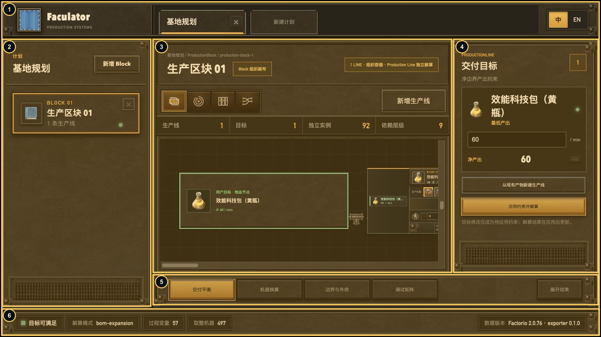
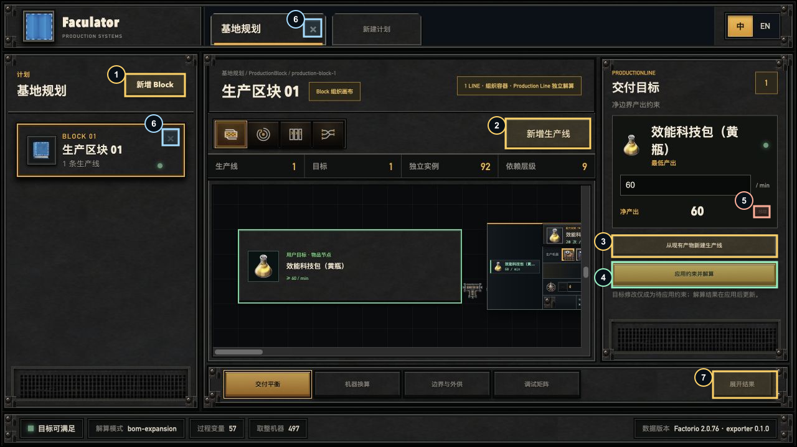
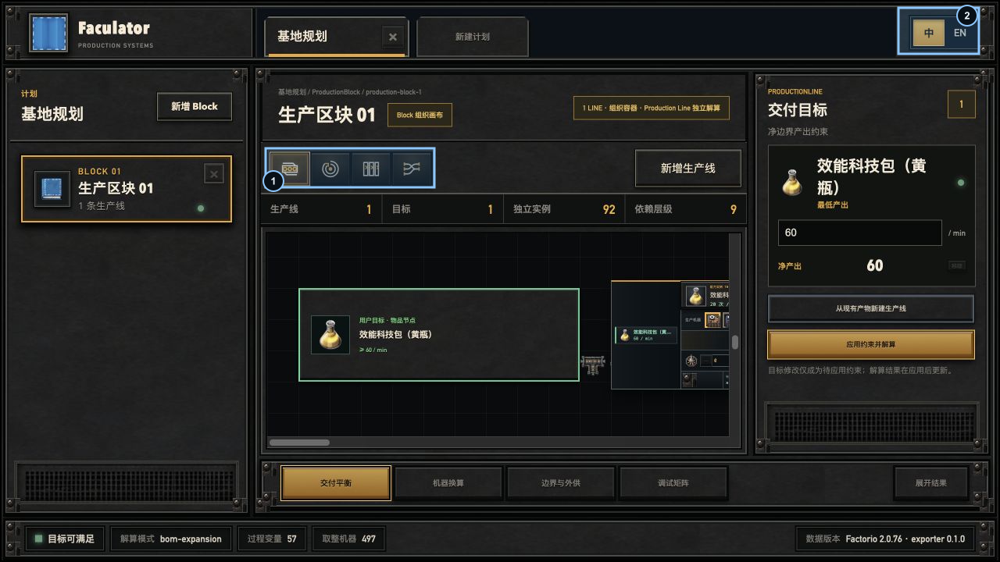
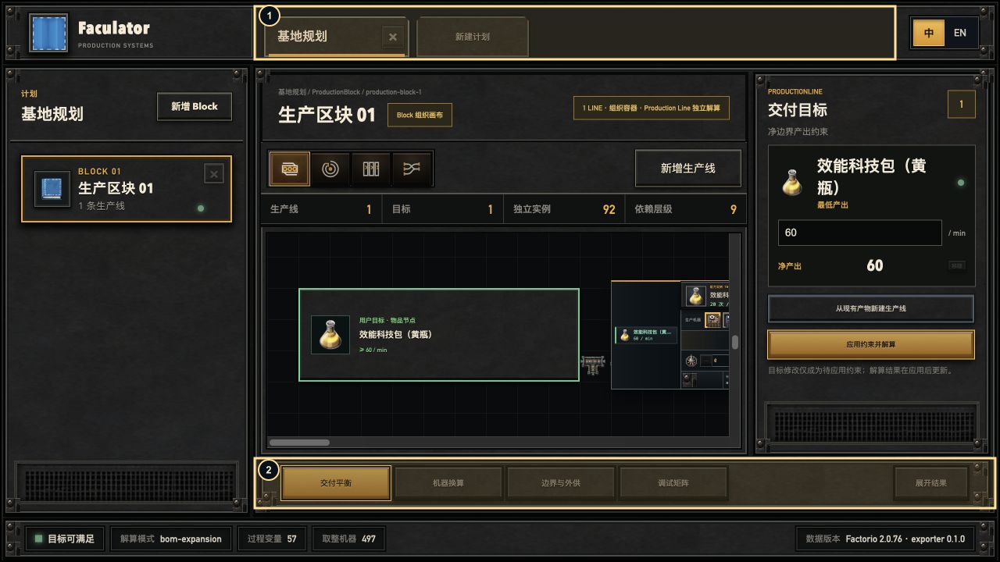
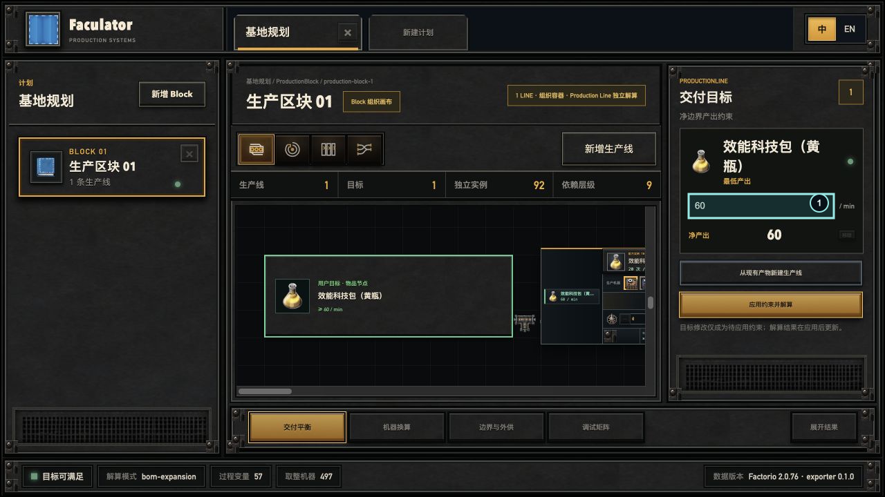
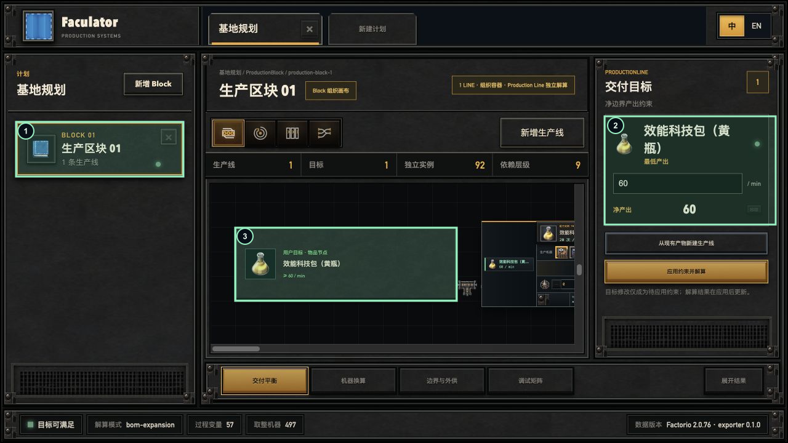
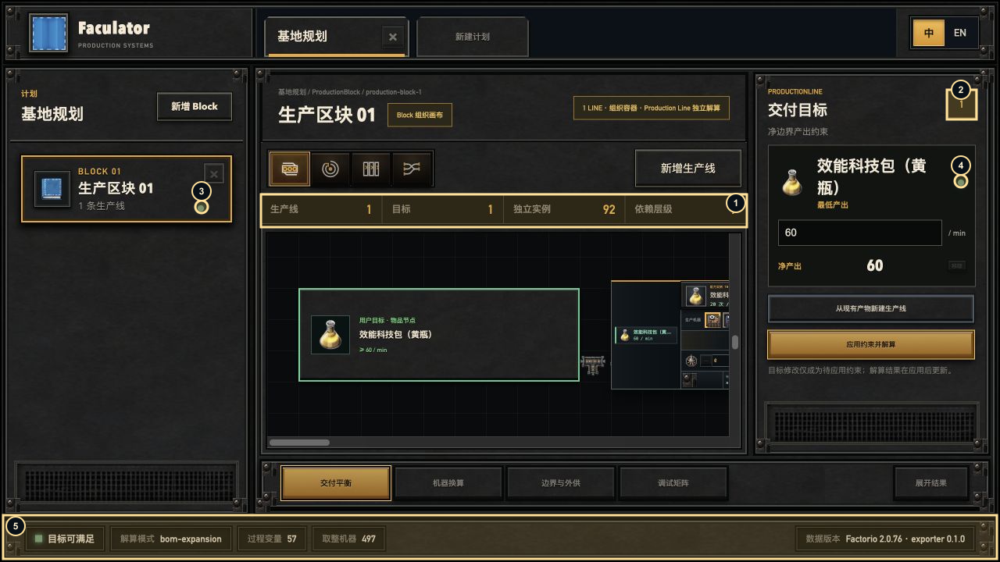
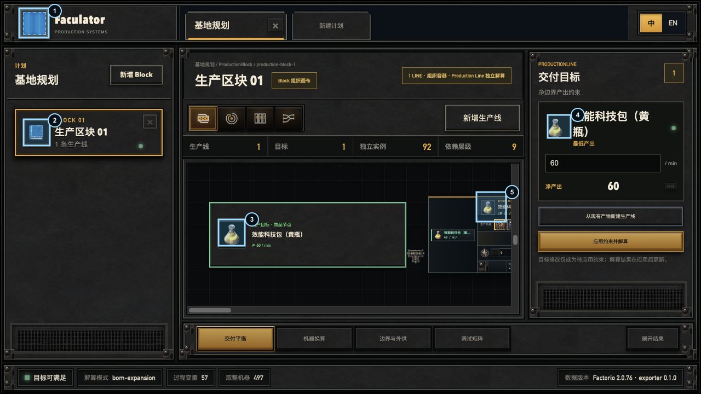

# 首页组件 TODO

这份文档采用“一组件一张图”的方式。每张图只标注同一种组件在首页中的所有出现位置；不同语义的外观变体写在图片下方。

## `FacPanel`

需要统一：Foundry 纹理、`2px solid` 外框、内框线、内阴影、外阴影、螺栓、padding 和不同高度变体。

标注位置包括：应用外壳、Block 侧栏、中心工作区、目标栏、结果抽屉、底部状态栏。`FacPanel` 应提供 `cabinet`、`header`、`toolbar`、`summary`、`drawer`、`footer` 变体。

## `FacButton`

图中只标按钮，不标 tab、panel 或 input。编号对应下面的语义：

| 编号 | 变体 | 首页位置 |
|---:|---|---|
| 1、2、3、7 | `neutral` | 新增 Block、新增生产线、从现有产物新建生产线、展开结果 |
| 4 | `primary` | 应用约束并解算 |
| 5 | `warning + disabled` | 移除目标，目前不可用 |
| 6 | `icon` | 关闭计划、删除 Block |

需要统一按钮几何和交互动画，但保留语义差异：

- `neutral`：新增 Block、新增生产线、从现有产物新建生产线、展开结果。
- `primary`：应用约束并解算。
- `warning/disabled`：移除目标，目前不可用。
- `icon`：关闭计划、删除 Block。

按钮还应明确 `idle`、`hover`、`focus-visible`、`active`、`disabled` 五种状态。

## `FacSegmented`

需要统一 segmented 的机械交互：未选中弹起，选中按下，hover 提亮，键盘 focus 可见。当前用于语言切换和观察视图切换；两处尺寸可以不同，但状态语义必须一致。

## `FacTabs`

需要统一选中下沿、tab 间距、关闭按钮和 active 状态。当前用于顶部计划标签和底部结果标签。计划标签包含关闭动作，结果标签不包含关闭动作。

## `FacInput`

当前首页可见的是目标产出速率字段。组件需要支持 label/单位、数字格式化、focus、dirty、invalid、disabled，并保留工业控制台的凹入式输入框外观。

## `FacCard`

当前标注的是三种 Card 语义：Block 选择卡、目标卡、画布中的生产节点卡。它们共享卡片容器、图标框、标题和状态点，但 active、selected、target、process 状态不能只靠同一个 class 混用。

## `FacStatus`

需要拆成可组合的小组件：`FacStatusDot`、`FacBadge`、`FacStatCell`、`FacStatusBar`。状态颜色应表达 ready、pending、error、idle；数字统计需要统一技术字体、间距和对齐方式。

## `FacIcon`

需要区分两类：`FacGameIcon` 负责物品/机器/配方资源图标，`FacIconButton` 负责关闭、删除等可操作图标。图标尺寸、容器边框和图标本身不能混成一个组件。

## 第一轮不做的内容

目标百科、配方卡、机器选择、插件槽、物料轨道、依赖环、Finder 分栏和 Sankey 属于领域复合组件或可视化组件。等以上基础组件定稿后，再分别建立自己的单组件标注图。
